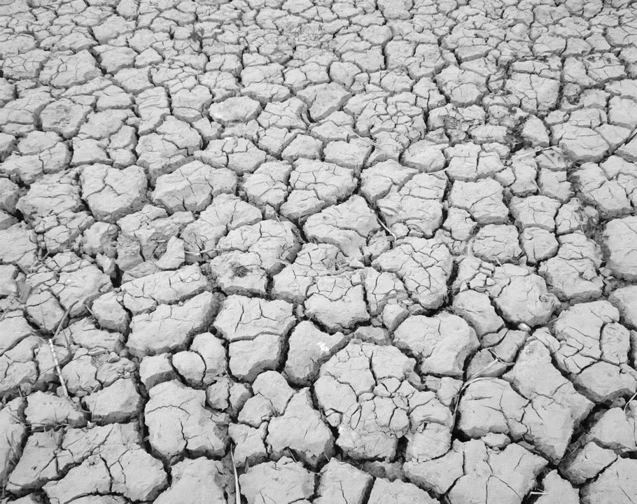
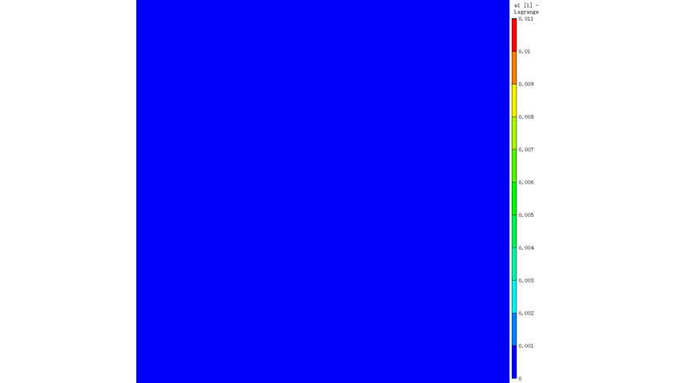
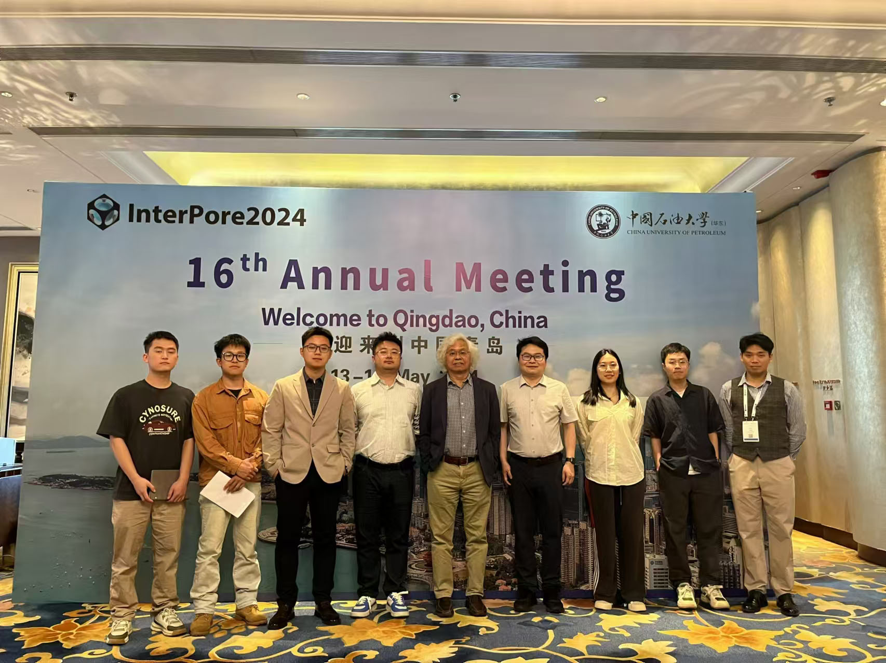

I am now a 5-th year Ph. D candidate in the College of Civil Engineering at Hunan University, supervised by [Prof. Chao Zhang](https://www.researchgate.net/profile/Chao-Zhang-43). I joined Prof. Zhang's [UNSAT lab](https://chaozhanghnu.github.io) in 2020 as a 3-rd year undergraduate student. 

In the UNSAT lab, I belong to a seven-member group focusing on stress state and constitutive relation for unsaturated soil. I assisted Prof. Zhang in managing this group and worked closely with the other five members. In addition to my research regarding desiccation cracking in porous media, I deeply participate in the research of the other six members, e.g., clay pore structure evolution via small-angle neutron scattering and small-angle scattering X-ray scattering, development of swimming robot in granular environments, deep-buried soil's anisotropies in fabric, stress and modulus, loading collapse phenomenon in high-expansive clay, etc. 

Research interests
======

  
  

My recent research passion lies in understanding **the underlying physics of desiccation cracking in porous media** (particularly in soils), which is a ubiquitous phenomenon in both nature and industry. It is a highly non-linear process, involving multi-physics processes such as evaporation, two-phase flow of vapor and water, heat transfer, and build-up of stress due to both the capillary pressure and the adsorption between nano-particles. With such complex processes:

* _How can we accurately predict the initiation of desiccation cracks?_ 

* _What is the key mechanism governing the fascinating self-organized pattern of desiccation cracks?_ 

* _Can we manipulate the propagation of desiccation cracks to create specific patterns on micro and nano scales?_ 

Now, I am trying to integral cutting-edge insights from **optical measurement techniques** (e.g., digital image correlation, micron CT, high-speed photography, etc.), **elastic-plastic fracture mechanics**, **phase transition theory in statistic physics**, and **fractal theory** to explore the physics of crack initiation and propagation, as well as the key underlying mechanism and statistic properties of desiccation crack pattern. 

If you are interested in my research, please get in touch with me via email (yhyang@hnu.edu.cn) or [WeChat](../images/wechat.jpg). 

News
======
**Paper (03/28):** Our paper titled ["Suction and Volume Evolutions of Clayey Soils upon High-Stress Unloading and Subsequent Soaking"](https://doi.org/10.1139/cgj-2026-0045) was published in _**Canadian Geotechnical Journal**_.

**Paper (03/26):** Our paper titled ["Measuring fracture toughness of clayey soils in a wide suction range"](https://doi.org/10.1680/jgeot.25.00080) was published in _**Géotechnique**_.

**Talk (12/25):** I attended the _AGU 2025 Annual Meeting_ and give an oral presentation "Measuring fracture toughness of clayey soils in a wide suction range".

**Talk (12/25):** I attended the _80th Anniversary Conference of KSME_ and give an oral presentation "Role of pore structure heterogeneity on clay desiccation cracking".

  <button onclick="prevImage()" class="gallery-button gallery-button-prev"></button>
  
  <button onclick="nextImage()" class="gallery-button gallery-button-next"></button>

