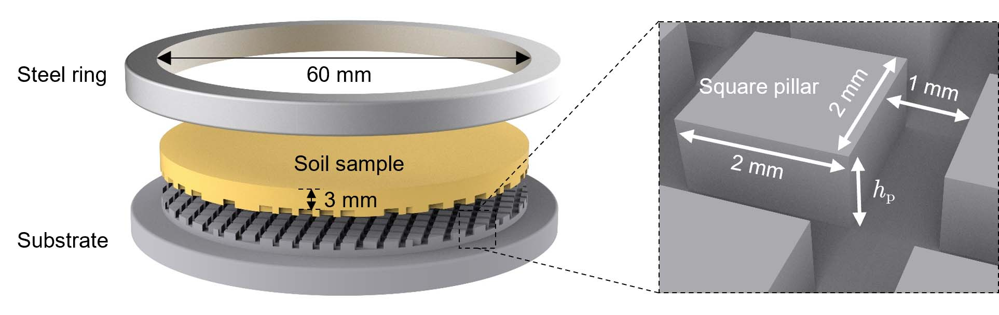
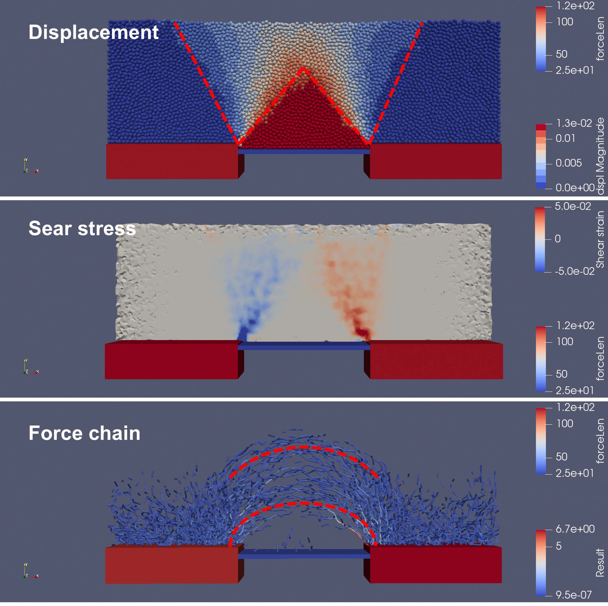
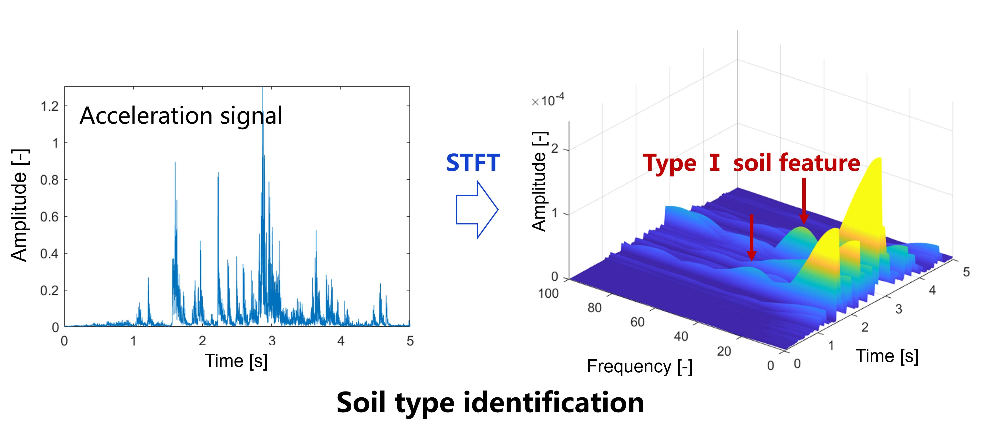
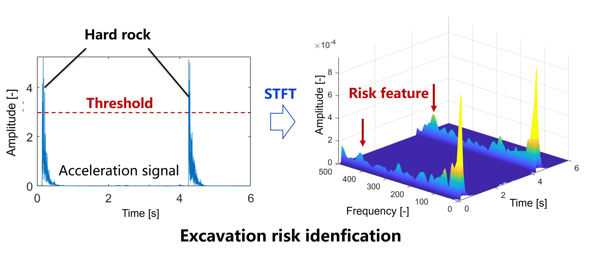



Education and Qualifications
======
* **Ph.D in Geotechnical Engineering, Hunan University**, Sep. 2021 - Present

  Core-curriculum: Numerical Analysis, Dynamics of Structure, Rock and Soil Dynamics, Advanced Soil Mechanics.
  
* **B.S. in Geotechnical Engineering, Hunan University**, Sep. 2017 - Jun. 2021

  Core-curriculum: Advanced Mathematics, Theory of Elasticity, Mechanics of Materials, Fluid Mechanics, Soil mechanics, Structral Mechanics.

  GPA: 3.77/4.00.          Ranking: 6/43.

Research Interests
======
Desiccation Cracking in Porous Media; Drying Process of Colloidal Material; Fracture Mechanics of Soft Matters; Unsaturated Soils Mechanics. 

Publications
======
  <ul>
    
  </ul>

Research Experience: Taking the Lead
======

* A new equipment for measuring fracture toughness of soil with variable water contents (Nov. 2022 ~ present).

  * Granted national invention patent: Zhang, **Yang**, Chen. CN118090432B, 2024-06-28.
  * The paper is being written (main contributor). 

* Fabric, stress, and modulus anisotropies of deep-buried soil (Jul. 2023 ~ Jul. 2024)

  * The paper is under review: **Yang**, Liu, Zhang, et al. Fabric, Stress, and Modulus Anisotropies in Sand during High-Stress Oedometer Test.

* Regulating cracking mode in desiccating clay (May 2023 ~ Jun. 2024)

  * The paper is under review: **Yang**, Zhang, Chen. Nucleation-percolation transition in clay desiccation cracking. 

* Investigating the role of substrate roughness on soil desiccation cracking (Jul. 2021 ~ Oct. 2022).

  * Published paper: **Yang**, Zhang, Gou, et al. Role of Substrate Roughness in Soil Desiccation Cracking [J]. _Canadian Geotechnical Journal_, 2024 (ja).

  

* Cementation effect on soil arching via discrete element method (Jan. 2021 ~ Jun. 2021).

  * Soil arching is a typical stress redistribution phenomenon in soil subjected to unloading, which is crucial for designing underground structures and controlling ground deformation during construction. Yet, how the soil arching evolves in the cemented soil remains elusive. The discrete element method is utilized to simulate the trap door experiment, exploring the stress redistribution and fabric evolution in cemented sand upon unloading.

  

  <video width="500" controls>
    <source src="../images/SoilArching.mp4" type="video/mp4">
  </video>

* Development of algorithm and system for risk and soil type identifications in real-time in autonomous excavators (Sep. 2020 ~ Dec. 2020).

  * Developing an autonomous excavator is crucial for excavation in high-risk construction environments such as the deep ocean and exo-planets, yet it faces two challenges: 1) detecting excavation risk in real time, e.g., detecting unexpected hard rock and existing underground constructions; and 2) detecting soil types during excavation in real time for automatically adjusting excavation strategy. To solve these problems, this work developed a new real-time algorithm based on both time- and frequency- domain analyses of acceleration signals. Moreover, an excavation experiment was conducted to determine the appropriate position of acceleration sensors and the hyperparameters of the proposed algorithm.

* Granted national invention patent: Zhang, **Yang**, et al. CN113065388B, 2022-11-01.

  
  

Research Experience: Participation
------
Nanopore evolution in clay during drying via small-angle neutron scattering and small-angle X-ray scattering (Nov. 2022 ~ Present)
------

Loading collapse in clays of high expansibility (Jun. 2023 ~ Present)
------

  
Skills
======
* Skill 1
* Skill 2
  * Sub-skill 2.1
  * Sub-skill 2.2
  * Sub-skill 2.3
* Skill 3
  
Talks
======
  <ul>
    
  </ul>
  
Teaching
======
  <ul>
    
  </ul>
  
Service and leadership
======
* Currently signed in to 43 different slack teams
