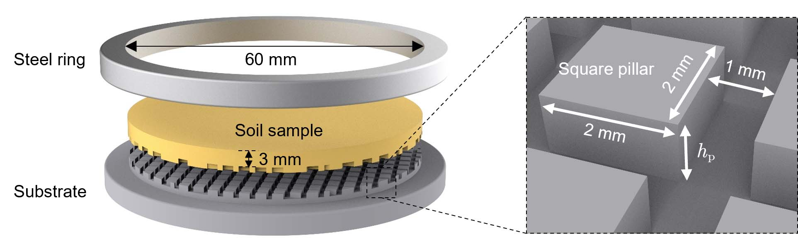
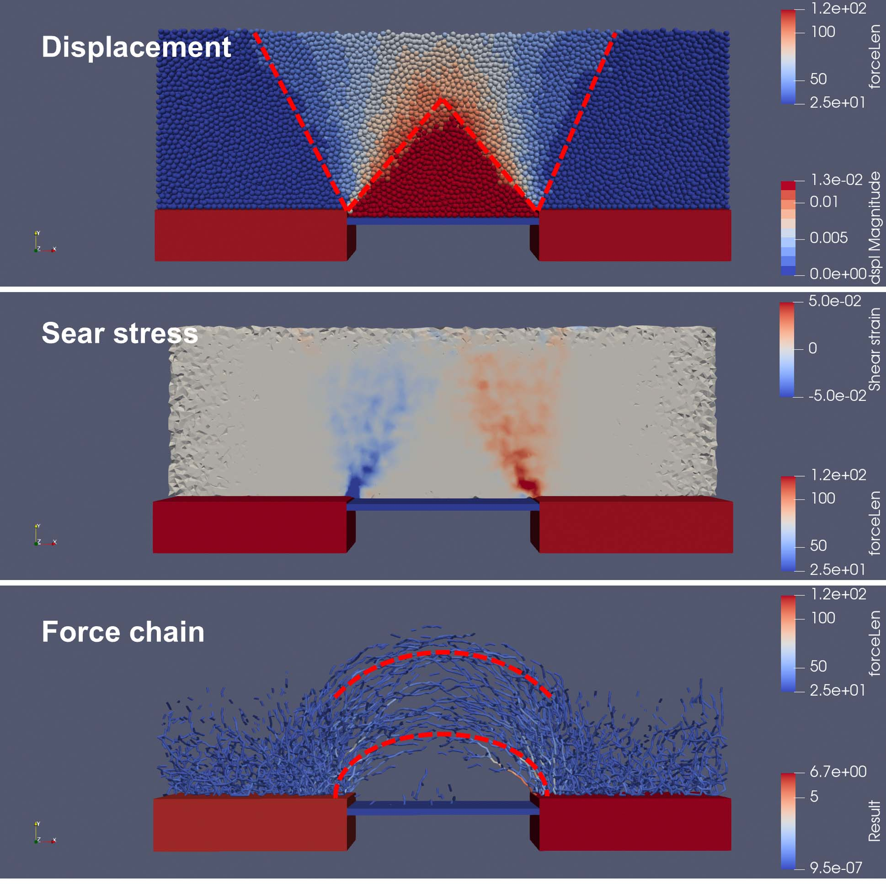
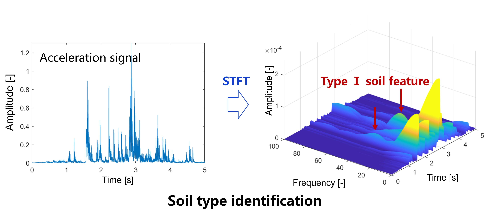
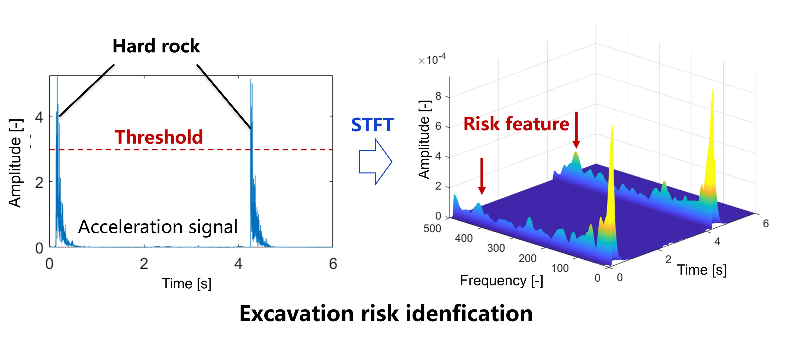



Education and Qualifications
======
* **Ph.D in Civil Engineering ([ARWU Top 15 Academic Subjects Worldwide](https://www.shanghairanking.com/rankings/gras/2023/RS0211)), Hunan University, China**, Sep. 2021 - Present

  Core-curriculum: Numerical Analysis, Rock and Soil Dynamics, Advanced Soil Mechanics.

* **Visiting Student Researcher in Mechanical Engineering, KAIST (No.53 in QS World University Rankings 2025), South Korea**, Sep. 2025 - Mar. 2026, supported by China Scholarship Council (CSC).

  Research topic: Cracking in drying colloidal.
  
* **B.S. in Civil Engineering ([ARWU Top 15 Academic Subjects Worldwide](https://www.shanghairanking.com/rankings/gras/2023/RS0211)), Hunan University, China**, Sep. 2017 - Jun. 2021

  Core curriculum: Advanced Mathematics, Theory of Elasticity, Mechanics of Materials, Fluid Mechanics, Soil Mechanics, Structural Mechanics.

  GPA: 3.77/4.00.          Ranking: 6/43.

Research Interests
======
Desiccation Cracking in Porous Media; Drying Process of Colloidal Material; Fracture Mechanics of Soft Matters; Unsaturated Soils Mechanics. 

Publications
======
  <ul>
    
  </ul>

Research Experience: Taking the Lead
======
* Thaw-indued landslide in permafrost region (Mar. 2026 ~ Present)

* Modeling evolution of fracture toughness of clayey soils (Dec. 2025 ~ Present)

* Suction and volume evolutions of clayey soils upon high-stress unloading and subsequent Soaking (Apr. 2025 ~ Mar. 2026)

  * Published paper: **Yang, Y.**, <u>Zhang</u>, C., Liu, Z., Yuan, J., & Chen, R. (2026). Suction and Volume Evolutions of Clayey Soils upon High-Stress Unloading and Subsequent Soaking. Canadian Geotechnical Journal, (ja).

* A new equipment for measuring fracture toughness of soil with variable water contents (Nov. 2022 ~ Oct. 2025).

  * Granted national invention patent: <u>Zhang</u>, **Yang**, Chen. CN118090432B, 2024-06-28.
  * Published paper: **Yang, Y.**, & <u>Zhang, C</u>. (2026). Measuring fracture toughness of clayey soils in a wide suction range. _Géotechnique_, 1-15.

* Stress, and modulus anisotropies of deep-buried soil (Jul. 2023 ~ Jul. 2024).

  * The paper is under review: **Yang**, Liu, <u>Zhang</u>, et al. Stress and Modulus Anisotropies in Sand during High-Stress Oedometer Test, submitted to _Acta Geotechnica_

* Role of pore heterogenity on desiccation cracking of clayey soil (May 2023 ~ Jun. 2024).

  * Published paper: **Yang, Y.**, <u>Zhang, C.</u>, <u>Kim, H.</u>, & Chen, R. (2025). Nucleation-percolation transition in desiccation cracking of clay. _Physical Review E_, 111(5), L053501.

* Role of substrate roughness on soil desiccation cracking (Jul. 2021 ~ Oct. 2022).

  * Published paper: **Yang, Y.**, <u>Zhang, C.</u>, Gou, L., Chen, R., & Dong, Y. (2024). Role of substrate roughness in soil desiccation cracking. _Canadian Geotechnical Journal_, 61(12), 2686-2703.

  

* Cementation effect on soil arching via discrete element method (Jan. 2021 ~ Jun. 2021).

  * Soil arching is a typical stress redistribution phenomenon in soil subjected to unloading, which is crucial for designing underground structures and controlling ground deformation during construction. Yet, how the soil arching evolves in the cemented soil remains elusive. The discrete element method is utilized to simulate the trap door experiment, exploring the stress redistribution and fabric evolution in cemented sand upon unloading.

  

  <video width="500" controls>
    <source src="../images/SoilArching.mp4" type="video/mp4">
  </video>

* Development of algorithm and system for risk and soil type identifications in autonomous excavators (Sep. 2020 ~ Dec. 2020).

  * Developing an autonomous excavator is crucial for excavation in high-risk construction environments such as the deep ocean and exo-planets, yet it faces two challenges: 1) detecting excavation risk in real-time, e.g., detecting unexpected hard rock and existing underground constructions; and 2) detecting soil types during excavation in real-time for automatically adjusting excavation strategy. To solve these problems, this work developed a new real-time algorithm based on both time- and frequency- domain analyses of acceleration signals. Moreover, an excavation experiment was conducted to determine the appropriate position of acceleration sensors and the hyperparameters of the proposed algorithm.

  * Granted national invention patent: <u>Zhang</u>, **Yang**, et al. CN113065388B, 2022-11-01.

  
  

PS: **Bold** indicates me, and underline indicates my supervisor.

Research Experience: Participating in
======

* Freezing-induced stress and flow in porous media (Aug. 2024 ~ Present).

* Developing a swimming robot in granular media (Jul. 2024 ~ Present).

* Loading collapse in clays of high expansibility (Jun. 2023 ~ Present).

* Nanopore evolution in clay during drying via small-angle neutron scattering and small-angle X-ray scattering (Nov. 2022 ~ Jun. 2025).

Skills
======
* Knowledge
  * Unsaturated soil mechanics
  * Fracture mechanics
  * Fractal theory
  * Phase transition theory
  * Critical state soil mechanics
* Experiment skill
  * Digital image correlation (DIC)
  * High-speed photography
  * Bender element
  * Small-angle neutron scattering (SANS) and small-angle X-ray scattering (SAXS) tests
  * Scanning electron microscopy (SEM) test
  * Mercury intrusion porosimetry (MIP) test
  * Microfluidic chips
  * Single chip microcomputer (SCM)
* Programming & Software
  * C language programming
  * Python
  * YADE (open-source software of discrete element method)
  * Matlab
  * ANSYS & PLAXIS (software of finite element method)
  * Paraview
  * COMSOL

Talks
======
* **AGU Fall Meeting 2025**, Washington, D.C., USA, Dec. 2025.
**Oral presentation**: Measuring Fracture Toughness of Clayey Soils in Wide Suction Range.

* **80th Anniversary Conference of KSME**, South Korea, Dec. 2025.
**Oral presentation**: Role of pore structure heterogeneity on clay desiccation cracking.

* **AGU Fall Meeting 2024**, Washington, D.C., USA, Dec. 2024.
**Poster**: Nucleation-percolation transition in clay desiccation cracking.

* **IUTAM Symposium Interface Mechanics of Complex Flows and Soft Matter**, Beijing, China, Aug. 2024.
**Poster**: Role of substrate roughness in soil desiccation cracking.

* **IUTAM Symposium Interface Mechanics of Complex Flows and Soft Matter**, Beijing, China, Aug. 2024.
**Poster**: Role of substrate roughness in soil desiccation cracking.

  

* **InterPore 2024**, Qingdao, China, May 2024.
**Oral presentation**: Role of substrate roughness in soil desiccation cracking. 

* **1st International Yuelu Symposium on “Geotechnical and Underground Engineering”**, Changsha, China, Jun. 2024.
**Poster**: Fabric, stress, and modulus anisotropies of sands during high-stress oedometer test.

  

Honors and Awards
======
China Scholarship Council (CSC) Government-Sponsored Overseas Study Program, May 2025.

Outstanding Undergraduate Graduates of Hunan University, May 2021.

First Class Scholarship of Hunan University, Nov. 2020.

Merit Student of Hunan University, Nov. 2020.

Champion of Hunan University Soccer League, Jun. 2019.

Champion of Changsha Soccer League, Nov. 2018.

Excellent Organizer of Hunan University athletic meeting, Nov. 2018.
  
